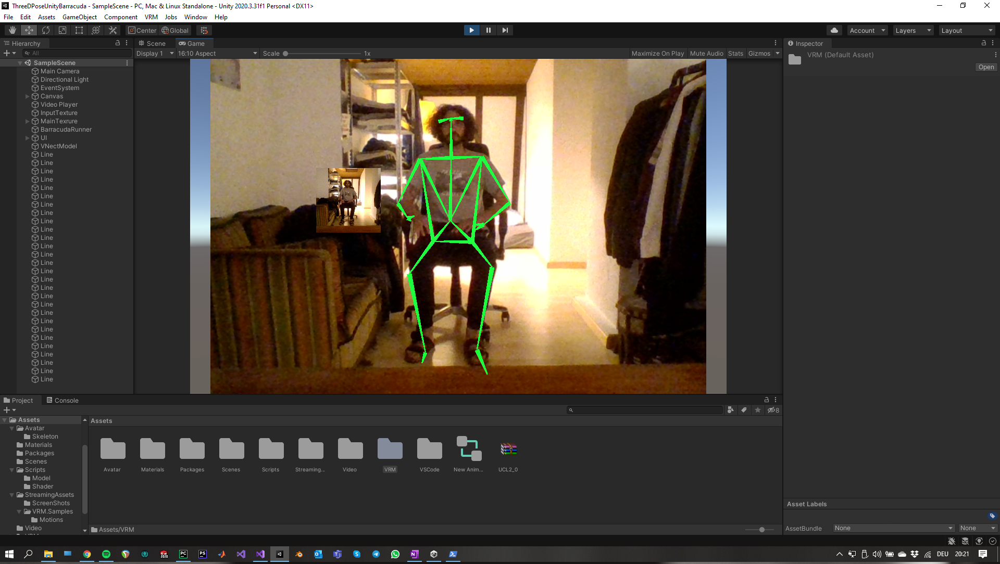

# ThreeDPoseUnityBarracuda
This project is a fork from the repo below and was stripped to only display the skeleton overlayed onto the webcam stream.
https://github.com/digital-standard/ThreeDPoseUnityBarracuda

## Outline
ThreeDPoseUnityBarracuda is a sample project which reads a VRect onnx model with Barracuda regresses a 3D human pose within Unity. The target should be only one person, multi target pose estimation is not supported.  

Ported to Unity 2020.3.31f1.  
Currently works with Barracuda 1.0.5  
Tested with Windows 10

## Performance Report
### GPU  
GeForce RTX2070 SUPER ⇒ About 30 FPS  
GeForce GTX1070 ⇒ About 20 FPS  

## Install and Tutorial
1. Download/clone this repo to your local PC and open the project with Unity 2020.3.31f1.

2. Download onnx from our home page by clicking following URL in our HP. 
   https://digital-standard.com/threedpose/models/Resnet34_3inputs_448x448_20200609.onnx
   Place the ONNX model in Assets/Scripts/Model/ 
   and drag-and-drop it to "NN Model" in Gameobject named as "BarracudaRunner" in Inspector view.
     

## How to make a good estimate?

The frame that can be optionally displayed in the upper left corner (InputTexture) is the input image to the trained model.
Make sure that the whole body fits in this frame.
It is not possible to correctly estimate if the limbs stick out due to the edges of this frame. Since the program is performed assuming that the whole body is always in the frame, the error will increase if it exceeds the limit.
Also, the background is as simple as possible, and pants are better than skirts.

## Info
・Record 
If you want to record the motion, the following package might be suitable. 
https://github.com/zizai-inc/EasyMotionRecorder 

## License
### Non-commercial use 
・Please use it freely for hobbies and research.  
  When redistributing, it would be appreciated if you could enter a credit (Digital-  Standard Co., Ltd.).  

### Commercial use 
・Non-commercial use only. 
  
